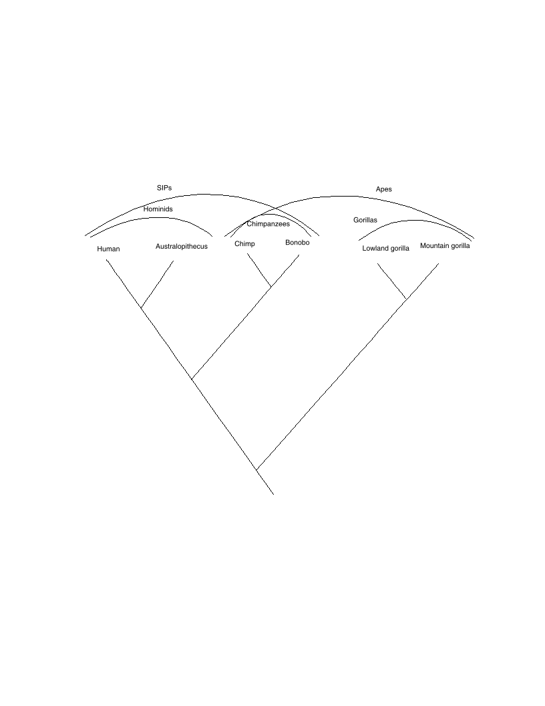

__MC.__ You are given data from a DNA hybridization study on a group of bacteria.  This data indicates how similar the DNA of each type is to that of each other type, but not what the differences are.  What kind of phylogenetic analysis could you do on these data?

A. Phenetic analysis

B. Cladistic analysis

C. Parsimony analysis

D. Either A or B

E. No phylogenetic analysis can be done

__MC.__ According to the figure above, which of the following groups is _not_ a clade?

A. Hominids

B. Chimpanzees

C. Apes

D. Gorillas

E. Australopithecus

__MC.__ According to the figure above, which of the following is _not_ a pair of sister taxa?

A. SIPs (self-important primates) and gorillas

B. Chimpanzees and hominids

C. Chimps and bonobos

D. Chimpanzees and gorillas

E. Humans and Australopithecus

__MC.__ You find a new fossil deposit with many red algal species, but no green plant species.  What would you conclude?

A. There were no plant species present at this time and location

B. Conditions were not right to fossilize plant species at this time and location

C. There was a mass extinction event among plant species at this time and location

D. Either A or B

E. Either B or C

__MC.__ Which of the following statements best describes the use of the principle of parsimony in constructing phylogenetic trees?

A. We use the tree that best reflects the molecular clock

B. We use the simplest tree that describes observed patterns

C. We use synapomorphies to identify related species

D. We use an outgroup to root the tree

E. We use parsimony to calculate the likelihood of the tree

__SA.__ You are studying a new clade, and identify three derived traits: flight, blueness and singing.  Species A is blue (only).  Species B flies and sings.  Species C is blue, flies and sings.

a) Make three separate, labeled trees showing the phylogenetic relationship between A, B and C that you would infer if you looked only at one trait at a time. 

b) Based on all the data above, what is your best guess for the correct phylogenetic tree, and why? 

c) Which of the trees from part a) differs from the one in part b)? 

