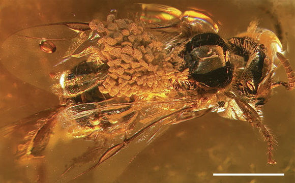

* [Handouts (please print and bring to class)](/materials/phylogeny.handouts.pdf)
 
  * [Complete notes (for reference only, no need to print)](/materials/phylogeny.complete.pdf)
 

## Additional resources

 
* [Practice questions](phylo_ques.html)
	* [answers](phylo_ans.html)
 

* [Vertebrate phylogeny](http://www.ucl.ac.uk/museums-static/obl4he/vertebratediversity/Vertebrata_cladogram2.png)([ucl.ac.uk](http://www.ucl.ac.uk/museums-static/obl4he/vertebratediversity/))
	* [Character-based version](http://evolution.berkeley.edu/admin/media/2/85597_evo_resources_resource_image_251_original.gif) ([evolution.berkeley.edu](http://evolution.berkeley.edu/admin/media/2/85597_evo_resources_resource_image_251_original.gif))
* [Angiosperms](http://www.botany.wisc.edu/courses/botany_400/images/lectureImages/AngiospermAPGII.jpg) ([botany.wisc.edu](http://www.botany.wisc.edu/courses/botany_400/Lecture/Lect02AngioPhyl.html))
* [Lizards and bipedalism](http://jeb.biologists.org/content/jexbio/211/13/2058/F1.large.jpg) ([J. Exper. Biol.](http://jeb.biologists.org/content/211/13/2058))

* [Coyotes and wolves](http://advances.sciencemag.org/content/2/7/e1501714)

* [The bee who was fossilized with orchid pollen](http://www.nature.com/news/2007/070829/full/news070827-4.html)

* [Bipedal lizard movie](https://www.youtube.com/watch?v=XAo09yYOpCU)
* [Jesus lizard movie](https://www.youtube.com/watch?v=45yabrnryXk)

